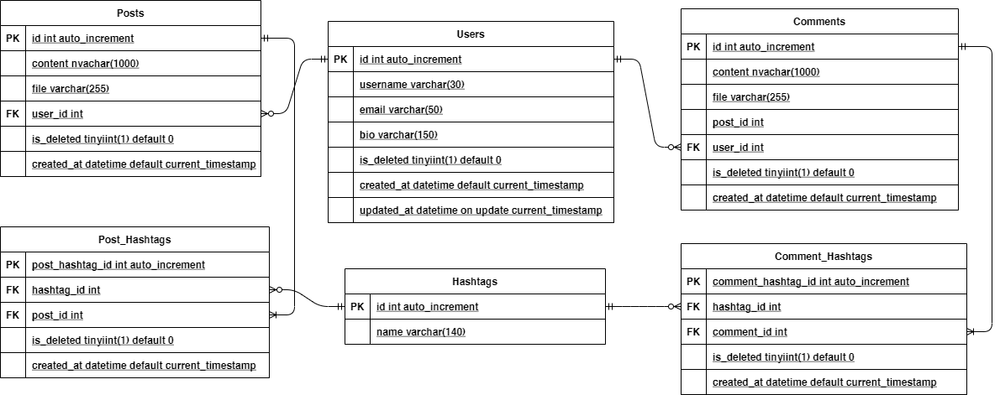

# Final Project

The final project of intermediate-class is social media

# Use Cases
1. save my username, email, and bio description.
2. post a text that might contain hashtag(s).
    Maximum limit of a text is 1000 characters
    A hashtag is a text that is followed by # symbol, for instance: #generasigigih
4. see all posts that contain a certain hashtag.
    A user can only filter by one hashtag at a time
5. see the list of trending hashtags.
    Trending hashtags are the top 5 most posted hashtags in the past 24 hours
    A post containing multiple instances of a hashtag only counts as 1 occurrence for trending hashtags calculation
6. comment on a post
    A comment can contain hashtag(s)
7. A hashtag occurrence in a comment is counted in trending hashtags calculation
    attach things to a post
    Three kinds of attachment are allowed: pictures (jpg, png, gif), video (mp4), and file (any other extensions outside of pictures and videos)

# Project Structure
```
|_ controllers
|_ coverage
|_ db
| |_ query.sql     
| |_ mysql_connector.rb  
|_ documentations
| |_ ERD.png 
| |_ postman_collections.json
|_ models
|_ public
| |_ assets
|_ spec
| |_controllers
| |_models
| |_storage
| |_spec_helper
|_ .rspec
|_ Gemfile       
|_ Gemfile.lock       
|_ README.md
|_ server.rb     
```

# Instructions
1. Install the needed gem
```gem install bundler```

Or install it yourself as: 
```
gem install sinatra
gem install sinatra-contrib
gem install mysql2
gem install dotenv
gem install rspec
gem install simplecov
gem install securerandom
```

2. Login to mysql using the username and password. Copy and paste `query.sql` contents to mysql.
3. Export the environment variables in terminal. Notes: DB_HOST can use `localhost` value for your personal environment.

```
export DB_HOST=<YOUR_HOST>          
export DB_NAME=social_media_db
export DB_USERNAME=<YOUR_USERNAME>
export DB_PASSWORD=<YOUR_PASSWORD>
```

4. Run ruby server.rb. To see the API enter localhost:4567/`<ENDPOINT>` in your [Postman](https://www.postman.com/downloads/).
5. To test, Run `rspec -fd spec` to run all the specs.

# ERD

